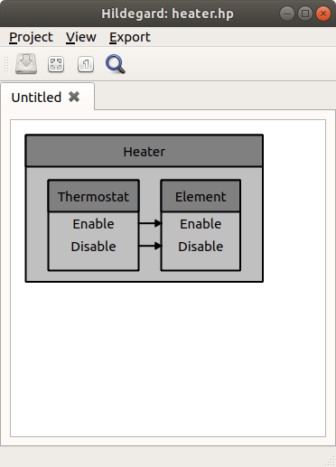

========
Workflow
========

Let us walk through a simple (but complete) example to demonstrate how
our code crafting tools can be leveraged in bottom-up and top-down
software development workflows.

Bottom-Up
=========

In a bottom-up workflow, the most fundamental, low-level pieces of
software are implemented first, and then functionality is
progressively added by assembling these pieces into more complex,
higher-level components.

Define Message Data Structures
------------------------------

The first step in a bottom-up workflow is to define the data content
and format of each message that is passed between software components
in the application.  This is accomplished by writing suitable data
structure declarations in `Tydl <tydl>`, our custom type definition
language.

.. highlight:: none

.. literalinclude:: HVAC/Temperature.td
   :caption:

Define Component Messaging Interfaces
-------------------------------------

The second step is to define the messaging interface for each software
component in the application.  Components have input ports for
receiving messages from other components and output ports for sending
messages to other components.  Each port has a name and an associated
data type that defines the message format.  If no data type is
specified, all messages sent or received on that port are treated as
events with no data content.  Component messaging interfaces are
defined using the `Smidgen <smidgen>` syntax, which builds on `Tydl
<tydl>`.

.. table::
   :widths: 15 10
   :width: 100%
	   
   +-----------------------------------+------------------------------+
   |                                   | .. only:: latex              |
   |                                   |                              |
   | .. literalinclude::               |      .                       |
   |    HVAC/Heating/Element.mi        |                              |
   |    :caption:                      | .. image:: element_mi.*      |
   +-----------------------------------+------------------------------+

.. table::
   :widths: 15 10
   :width: 100%

   +-----------------------------------+------------------------------+
   |                                   | .. only:: latex	      |
   |				       |			      |
   | .. literalinclude::	       |      .			      |
   |	HVAC/Temperature/Controller.mi |			      |
   |	:caption:		       | .. image:: controller_mi.*   |
   +-----------------------------------+------------------------------+

.. table::
   :widths: 15 10
   :width: 100%

   +-----------------------------------+------------------------------+
   |                                   | .. only:: latex              |
   |                                   |                              |
   | .. literalinclude::               |      .                       |
   |    HVAC/Temperature/Sensor.mi     |                              |
   |    :caption:                      | .. image:: sensor_mi.*       |
   +-----------------------------------+------------------------------+

.. table::
   :widths: 15 10
   :width: 100%
	   
   +-----------------------------------+------------------------------+
   |                                   | .. only:: latex              |
   |                                   |                              |
   | .. literalinclude::               |      .                       |
   |    HVAC/Thermostat.mi             |                              |
   |    :caption:                      | .. image:: thermostat_mi.*   |
   +-----------------------------------+------------------------------+

Declare Primitive Components
----------------------------

After defining the component messaging interfaces, the next step is to
provide declarations for each primitive C++ component that will be
implemented using the `Chimps <chimps>` framework.  The ``Chimps``
namespace is a superset of `Smidgen <smidgen>` that provides some
additional implementation-specific constructs like
``Stateful.Primitive``.

.. literalinclude:: HVAC/Heating/Element.pi
   :caption:

.. literalinclude:: HVAC/Temperature/Controller.pi
   :caption:

.. literalinclude:: HVAC/Temperature/Sensor.pi
   :caption:

Implement Primitive Components
------------------------------

Primitive C++ components are implemented by supplying header and
source files with class declarations and definitions that conform to
the `Chimps <chimps>` API.

.. highlight:: C++

.. literalinclude:: HVAC/Heating/Element.hpp
   :caption:

.. literalinclude:: HVAC/Heating/Element.cpp
   :caption:

.. literalinclude:: HVAC/Temperature/Controller.hpp
   :caption:

.. literalinclude:: HVAC/Temperature/Controller.cpp
   :caption:

.. literalinclude:: HVAC/Temperature/Sensor.hpp
   :caption:

.. literalinclude:: HVAC/Temperature/Sensor.cpp
   :caption:

.. highlight:: none

Define Composite Components
---------------------------

Once the primitive components have been implemented, they can be
combined and connected to form composite components that build on one
another in a hierarchic fashion.  Interconnections and component
hierarchies are specified using `Finch <finch>`, an extension of
`Smidgen <smidgen>`.

.. table::
   :widths: 13 10
   :width: 100%
	   
   +-----------------------------------+------------------------------+
   |                                   | .. only:: latex              |
   |                                   |                              |
   | .. literalinclude::               |      .                       |
   |    HVAC/Thermostat.hi             |                              |
   |    :caption:                      | .. image:: thermostat_hi.*   |
   +-----------------------------------+------------------------------+

.. table::
   :widths: 13 10
   :width: 100%
	   
   +-----------------------------------+------------------------------+
   |                                   | .. only:: latex              |
   |                                   |                              |
   | .. literalinclude::               |      .                       |
   |    HVAC/Heater.hi                 |                              |
   |    :caption:                      | .. image:: heater_hi.*       |
   +-----------------------------------+------------------------------+

Declare the Application
-----------------------

Configurable hierarchic applications can be automatically generated
from any top-level component that implements the ``Stateful.IO``
messaging interface.

.. literalinclude:: HVAC/Heater.ha
   :caption:

Arrange the Source Files
------------------------

Source files are generally arranged in a directory structure that
reflects the namespace hierarchy::
  
  HVAC/
  ├── Heater.ha
  ├── Heater.hi
  ├── Heating
  │   ├── Element.cpp
  │   ├── Element.hpp
  │   ├── Element.mi
  │   └── Element.pi
  ├── Temperature
  │   ├── Controller.cpp
  │   ├── Controller.hpp
  │   ├── Controller.mi
  │   ├── Controller.pi
  │   ├── Sensor.cpp
  │   ├── Sensor.hpp
  │   ├── Sensor.mi
  │   └── Sensor.pi
  ├── Temperature.td
  ├── Thermostat.hi
  └── Thermostat.mi

Build the Application
---------------------

Finally, our code crafting command-line tool chain can be used to
build an executable program from from the source files in accordance
with the application declaration by issuing the following command in
the parent directory::

  chimps --build=app --all HVAC

This command automatically performs all of the intermediate steps
required to build the application, which are broken out below for
instructional purposes::

  chimps --generate=type --entity=HVAC.Temperature.Measurement HVAC
  chimps --generate=impl --entity=HVAC.Heating.Element.Impl \
                         --entity=HVAC.Temperature.Controller.Impl \
                         --entity=HVAC.Temperature.Sensor.Impl \
                         --entity=HVAC.Thermostat.Impl \
                         --entity=HVAC.Heater.Impl HVAC
  chimps --generate=app  --entity=HVAC.Heater.App HVAC
  chimps --compile=type  --entity=HVAC.Temperature.Measurement HVAC
  chimps --compile=impl  --entity=HVAC.Heating.Element.Impl \
                         --entity=HVAC.Temperature.Controller.Impl \
                         --entity=HVAC.Temperature.Sensor.Impl \
                         --entity=HVAC.Thermostat.Impl \
                         --entity=HVAC.Heater.Impl HVAC
  chimps --compile=app   --entity=HVAC.Heater.App HVAC

Run the Application
-------------------

The resulting program can be executed like this::
  
  ./Heater Thermostat.Controller.Setpoint=67.0

Top-Down
========

In a top-down workflow, the process starts with defining the
high-level components and generalized data flow.  Development proceeds
by progressively breaking down each component into smaller
subcomponents and defining the data flow in more detail.  The final
step is actually implementing the primitive components.

Define the Top-Level Components and Data Flow
---------------------------------------------

The first step in a top-down workflow is to define the top-level
components and how data flows between them.  The application structure
can be described directly using `Smidgen <smidgen>` and `Finch
<finch>`, or by creating block diagrams using the `Hildegard
<hildegard>` GUI application.

Note that since we are not dealing with concrete implementations at
this stage in the design process, subcomponents are specified in terms
of their interface (e.g. ``Thermostat.IO``) instead of their
implementation (e.g. ``Thermostat.Impl``).

.. literalinclude:: top-down/Heater.hi
   :caption: HVAC/Heater.hi
   :emphasize-lines: 10,11

``HVAC/Thermostat.mi`` and ``HVAC/Heating/Element.mi`` are defined as
shown in the `bottom-up section <Define Component Messaging
Interfaces_>`_.

Iteratively Define Subcomponents
--------------------------------

The second step is to break each component down into smaller
subcomponents and repeat the process until the entire system can be
described in terms of primitive components.  In this example,
``Heating.Element`` is implemented as a primitive C++ component, but
``Thermostat`` is is composite component consisting of a ``Sensor``
and a ``Controller``.

.. image:: thermostat_hi.*
   :width: 60%

Once again, note that subcomponents are specified in terms of their
interface (e.g. ``Sensor.IO``) instead of their implementation
(e.g. ``Sensor.Impl``) at this point.

.. literalinclude:: top-down/Thermostat.hi
   :caption: HVAC/Thermostat.hi
   :emphasize-lines: 10,11

``HVAC/Temperature/Sensor.mi`` and ``HVAC/Temperature/Controller.mi``
are similar to what was shown in the `bottom-up section <Define
Component Messaging Interfaces_>`_.  The only differences are that the
configuration properties and the message content for the sensor
measurement have not yet been defined.

.. literalinclude:: top-down/Sensor.mi
   :caption: HVAC/Temperature/Sensor.mi
   :emphasize-lines: 8,9

.. literalinclude:: top-down/Controller.mi
   :caption: HVAC/Temperature/Controller.mi
   :emphasize-lines: 8,9

Refine Data Flow
----------------

The next step is to fully define the data content and format of each
message that is passed between software components in the application.
In this example, the only message with content is the sensor
measurement, which is defined as shown in the `bottom-up section
<Define Message Data Structures_>`_.  ``HVAC/Temperature/Sensor.mi``
and ``HVAC/Temperature/Controller.mi`` should also be updated with a
matching ``type`` attribute, as shown `before <Define Component
Messaging Interfaces_>`_.

Define Configuration Properties
-------------------------------

Before proceeding with the implementation, it is good to give some
consideration to what configuration properties may be required.  These
can be added to the component messaging interfaces, as shown
previously in the `bottom-up section <Define Component Messaging
Interfaces_>`_.

Declare and Implement Primitive Components
------------------------------------------

Coming soon...

Update Composite Component Definitions
--------------------------------------

More to come...

Final Steps
-----------

This should do it...
